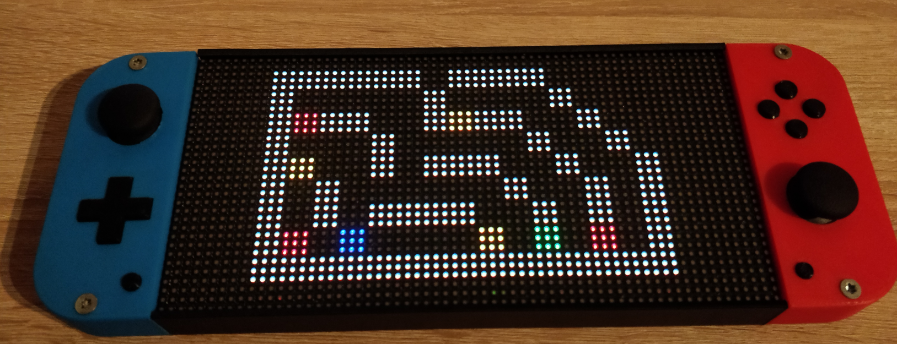

# Pxldeck

DIY Handheld Games Console with an 32x64 Led Matrix driven by ESP32.

The Display is an P3 HUB75 LedMatrix Module.
Lots of this Modules are usally used in Advertisement Panels.
The Case is entirely 3D printed.

## Features
- 32x64 pixel screen which can be stupidly bright
- 15 buttons and two analog sticks as input
- 3000mAh battery which lasts like 10 hours
- ESP32 microcontroller providing WiFi Capabilitys, does all the gameplay processing and is driving the Screen
- ATXMega microcontroller doing battery management and input handling since the ESP just hasn't enough pins for all of that. It also serves as an USB to Uart converter so the consoles software can be updated just by plugging it into the PC.
- This Repo also contains an "Emulator" to run the games code on PC.
